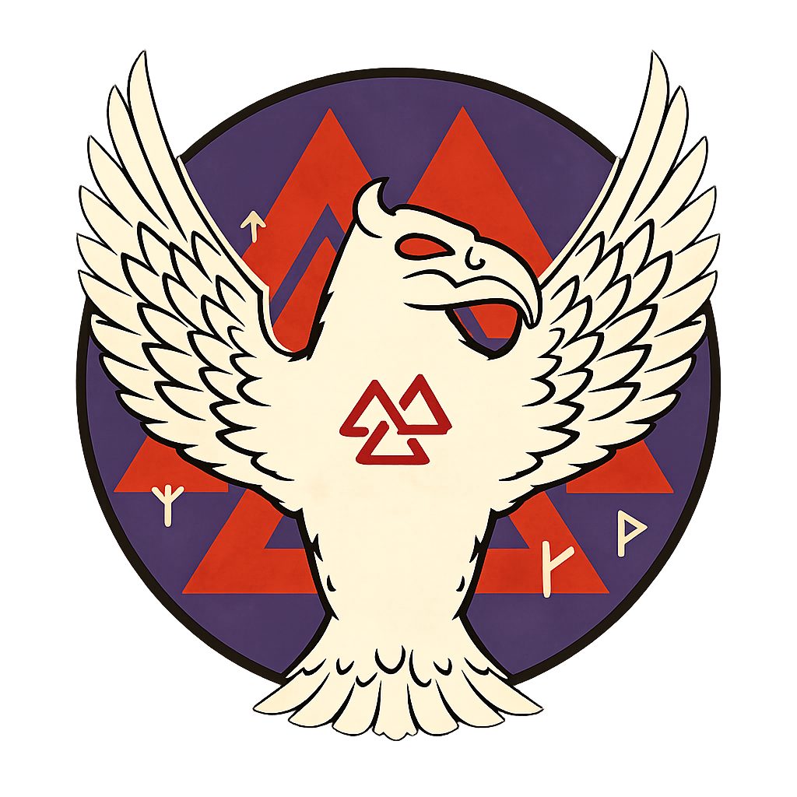

"Let's become Legends by defeating Myths!"

# Description

Valknut is a turn-based combat game inspired in Norse mythology. In this game, our heroes are searching for an enemyworthy enough to send them to Valhalla! 
This is the repository our team is using to develope the game. Feel free to browse around!

# Project Structure
```
└── src/                            
    └── me/                                        # Intermediate directory to avoid conflicts with names
        ├── control/                               # Control part of the program where there is a Singleton based Controller
        │   └── Controller.java
        ├── factories/                             # Future implementation of Factory based pattern
        ├── model/                                 # All the logic of the game
        │   ├── items/                             # Items that can be use in the game
        │   │   ├── AgilityItem.java               
        │   │   ├── ClevernessItem.java
        │   │   ├── Complement.java                # Interface for items that complement other items
        │   │   ├── DamageItem.java
        │   │   ├── HealingItem.java
        │   │   ├── Inventory.java                 # Logic for the usage of items per character 
        │   │   ├── item.java                      # Abstact class that is extended by all items
        │   │   ├── ItemComplement.java            # Class for items that are complements
        │   │   └── ResistanceItem.java
        │   ├── Attribute.java                     # Physical related stats 
        │   ├── Character.java                     # Absract class for enemies and heroes
        │   ├── Combat.java                        # Logic for combats
        │   ├── CombatOption.java                  # Enum type for options for combats
        │   ├── Element.java                       # Elemental related stats
        │   ├── Enemy.java                         # General enemy logic
        │   ├── EnemyBuilder.java                  # Fix for enemies creation
        │   ├── Hero.java                          # General hero logic
        │   └── HeroBuilder.java                   # Fix for heroes creation
        ├── view/
        │   ├── CombatView.java                    # In charge of combat input - output
        │   ├── ConsoleColors.java                 # Util class
        │   ├── ConsoleIO.java                     # Abstract class for the different views
        │   ├── MenuView.java                      # In charge of the menu input - output
        │   ├── Messages.java                      # Util class to put all general messages
        │   ├── Story.java                         # Class where to place the text of the story
        │   └── StoryView.java                     # In charge of the story input - output
        └── Main.java                              # Start point of the program
